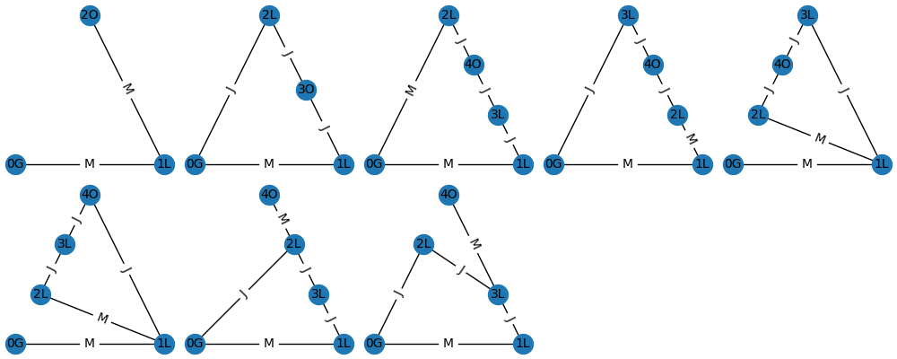
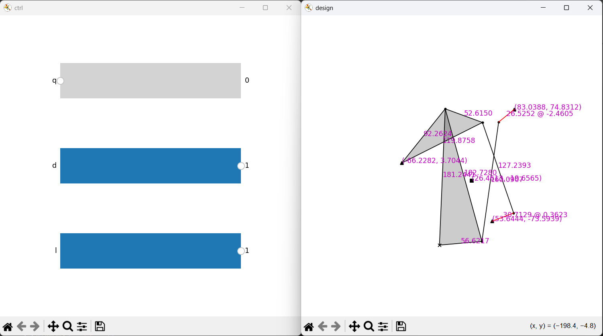
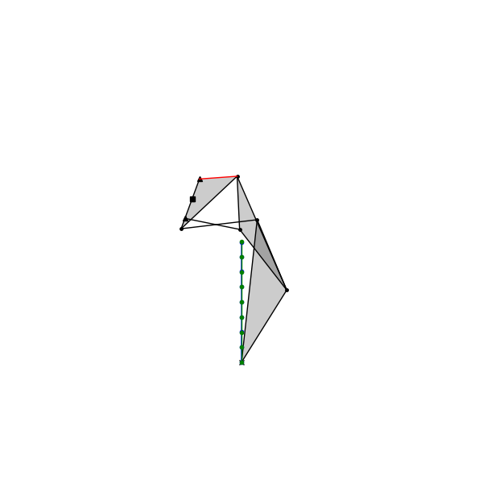
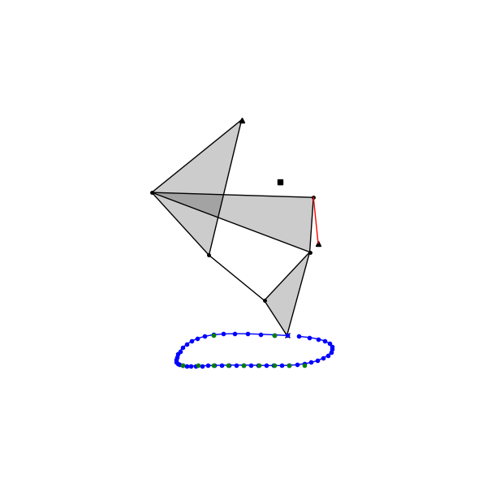
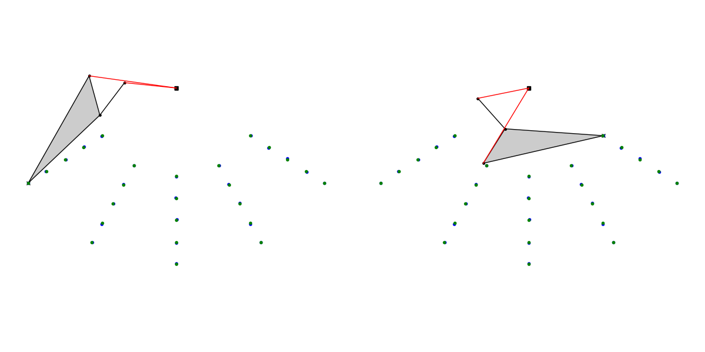
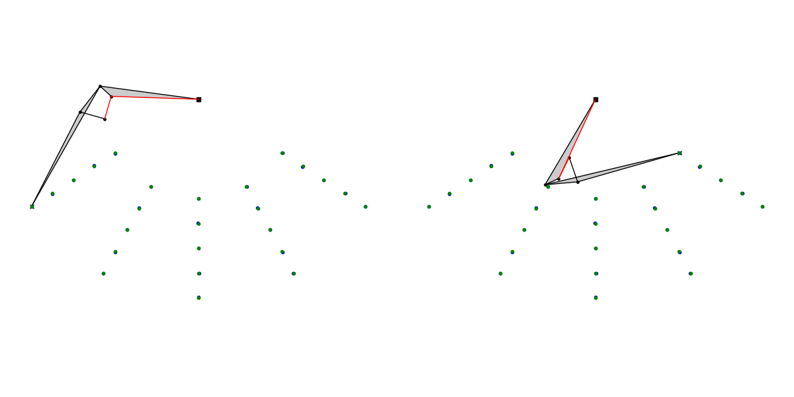
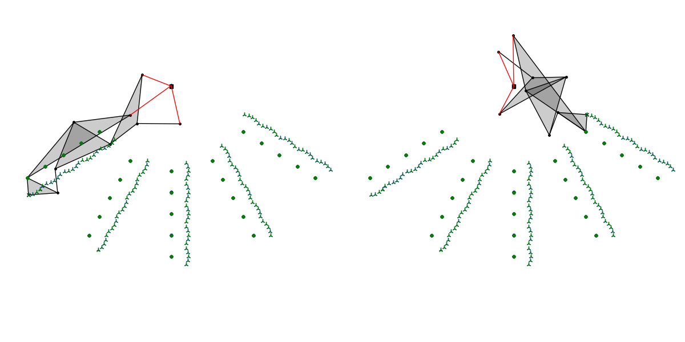

# AnyLinkage
Synthesize multi-degree-of-freedom multi-bar planar linkages, with flexible costs and constraints and GPU acceleration. 

## Setup
Clone this repository and create the Python environment. An environment file for [Miniconda](https://www.anaconda.com/docs/getting-started/miniconda/main) is provided and can be used with the following command. 

```
conda env create -f environment.yml
```

The installation might take a while. Once finished, the conda environment can be activated with the following command. 

```
conda activate any-linkage
```

In the future, this repository might be converted into a package with more detailed documentation. 

## Examples
All examples should be run at the root directory of this repository. An Nvidia GPU is recommended to improve speed. This code also uses `torch.compile` for further and very significant speedup, which is not well supported on Windows. 

### Enumerate Topologies
This example enumerates all the possible topologies and save the intermediate and final files under the automatically created `logs` folder. A pre-generated file is already included in the repository, but this example is useful if the topology generation algorithm is to be modified. 

```
python -m examples.enum_topologies
```

The following command can be used to resume a previous enumeration. 

```
python -m examples.enum_topologies PATH/TO/FOLDER
```

### Filter and Plot Topologies
This example shows how to filter the topologies and plot some, which is useful for investigating the available topologies and narrowing down specific ones for dimensional synthesis. 

```
python -m examples.filter_and_plot_topologies
```



### Sample Dimensions
This example shows how to randomly sample some designs (sets of dimensions) for a topology and plot them using the provided interactive plotter. The plotter allows changing input angles, selecting different designs, and toggling labels for the dimensions. 
```
python -m examples.sample_dimensions
```



### Design One-DoF Linear Leg
This example shows how to design a one-DoF linear leg. The foot of the leg tracks a straight line and the gear ratio is constant. It includes several commands.

Test some randomly sampled designs for a topology. 

```
python -m examples.design_one_dof_linear_leg t 0
```

Optimize the designs for a topology and save the design file in the `logs` folder. 

```
python -m examples.design_one_dof_linear_leg o 0
```

Sweep through all the topologies. Optimize and save their respective designs. 

```
python -m examples.design_one_dof_linear_leg s
```

Plot the designs in a design file.

```
python -m examples.design_one_dof_linear_leg p PATH/TO/FILE
```



### Design One-DoF Walking Leg
This example shows how to design a one-DoF walking leg. This is useful for building walking mechanisms. The available commands stay the same. 



### Design Two-DoF Constant Jacobian Leg
This example shows how to design a two-DoF constant jacobian leg. The Jacobian matrix that maps the input joint velocities to the foot velocities in the polar coordinate system should be constant. Both serial and parallel legs can satisfy the requirment. The available commands stay the same. 





### Design Three-DoF Parallel Leg
This example shows how to design a three-DoF parallel leg. The available commands stay the same. 



## Citation
The one-DoF topology generation and dimensional optimization are described in: 
```
@phdthesis{chen_toward_2025,
  author={Chen, Fuchen},
  title={Toward Informed Optimal Design of Task-Aware Robots},
  school={Arizona State University},
  year={2025},
  type={PhD thesis},
}
```